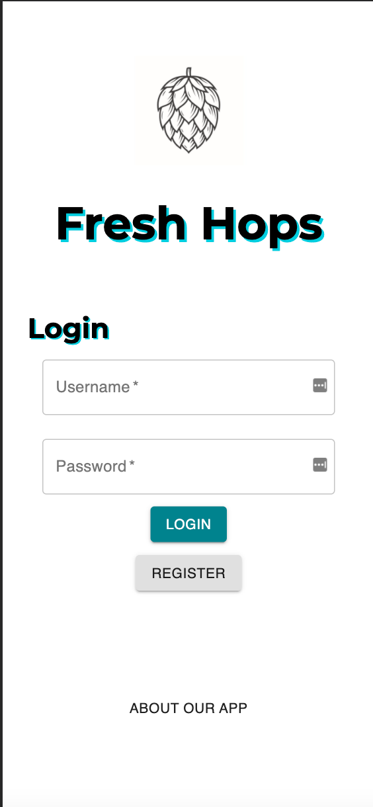
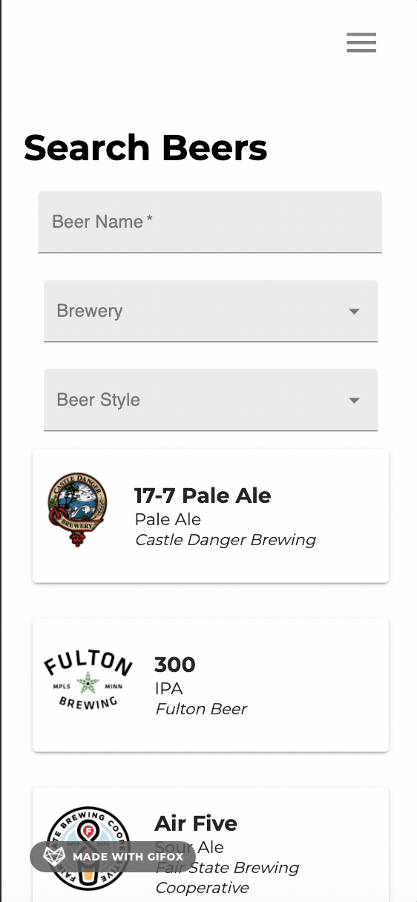
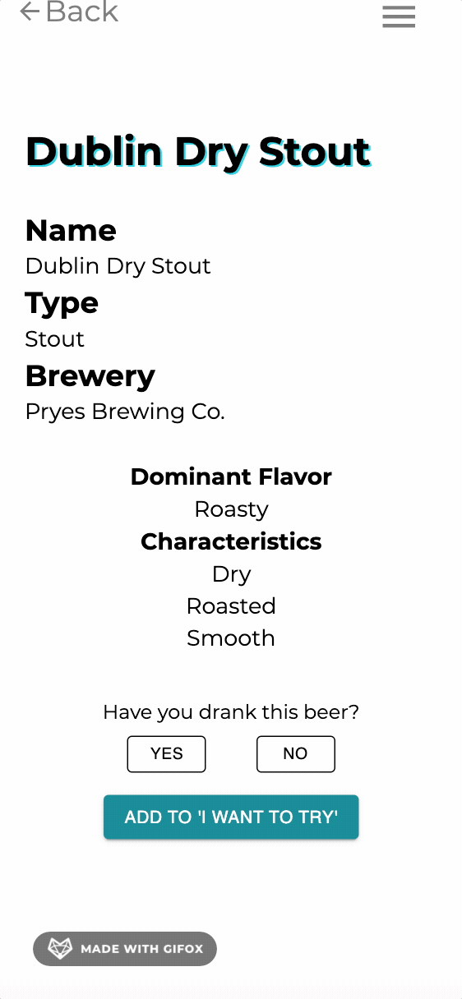
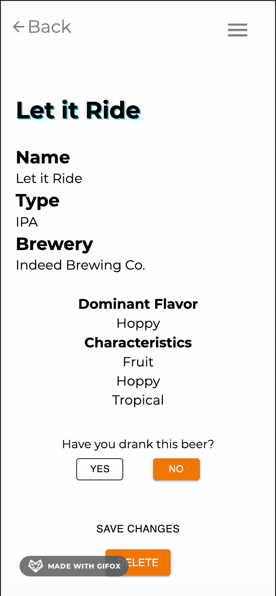

# Fresh Hops - Solo Project

## Description

See the [Fresh Hops app](http://fresh-hops.herokuapp.com/#/home) in action. Hosted on Heroku

_Duration: Three Week Sprint_

Fresh Hops is my solo project built for Prime Digital Academy. The app allows users to track beers that they drink, designate whether or not they liked a beer, and receive recommendations for new beers to try based on their liked beers. The recommendations are served using a custom algorithm that I developed. 

## Screen Shots

Login Page  

  

Searching and Finding a Beer  

  

Adding a beer to 'My Beers' list  

  

Custom Recommendations  

  

Changing the status of a beer

### Prerequisites

- [React.js](https://reactjs.org/)
- [Redux](https://redux.js.org/)
- [Node.js](https://nodejs.org/en/)
- [Postico](https://eggerapps.at/postico/)
- [PostgreSQL](https://www.postgresql.org/download/)

## Installation

1. Download the code from GitHub and open in an editor of your choice.
2. Create a database named `fresh-hops`.
3. The queries in the `database.sql` file are set up to create all the necessary tables and populate the needed data to allow the application to run correctly. This project is built on [Postgres](https://www.postgresql.org/download/), so you will need to make sure to have that installed. We recommend using Postico to run those queries as that was used to create the queries.
4. Open up your editor of choice and run `npm install` in your terminal. 
5. Run `npm run server` in your terminal.
6. Run `npm run client` in your terminal, which will open a new browser tab for you.

## Usage

1. Open the fresh hops app in a browser of your choice. Keep in mind, the app is optimized for mobile views.
2. Register for an account or Login if you have an existing account.
3. Click 'Search Beers' Button on the homepage, or open the menu on the right and click 'Search all Beers.'
4. On the Search Beers page use the search bars to find a beer that you like in Minneapolis.
5. Click on a beer card to see more information about the beer. 
6. If you have tried the selected beer, click 'Yes' under the 'Have you tried this beer?' section.
7. When you click 'Yes', a thumbs up and thumbs down icon will appear and you can designate whether or not you like the beer.
8. Once those fields are filled out, you can click the 'Add' button, and the app will add the beer to the appropriate list - 'My Beers' if you have tried the beer, or 'I Want to Try' if you have not tried the beer.
9. If you indicated that you have tried AND liked the beer, then fresh hops will find similar beers and you can find those recommendations when you go back to the home page. 
10. As a user, you are able to delete beers out of your 'My Beers' list and/or out of your 'I Want to Try' list. 
11. You are also able to switch whether or not you have tried a beer, or whether or not you liked a beer by clicking on the beer card to see the details of that beer.

## Built With

This application is built with HTML, CSS, Javascript, Axios, React, Redux, Redux Sagas, Express, PostgreSQL, and MaterialUI.

## Acknowledgement

Thanks to [Prime Digital Academy](www.primeacademy.io), and specifically Edan Schwartz, and Chad Smith who equipped me with the knowledge that helped me to make this application a reality.